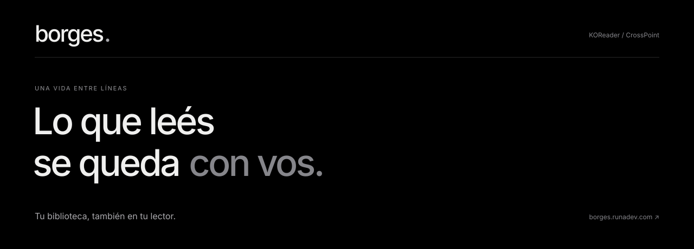

<p align="center"></p>

<p align="center"><strong>Your reader. Your highlights. One library.</strong><br>Connect KOReader to Borges and keep your reading together.</p>

<p align="center"><a href="https://github.com/totokatz/borges.koplugin/releases/latest/download/borges.koplugin.zip"><strong>↓ Download Borges for KOReader</strong></a><br><br><a href="../README.md">Castellano</a> · <a href="https://borges.runadev.com/guia/?lang=en">Visual guide</a> · <a href="https://borges.runadev.com">Open Borges</a></p>

---

## Your reading, connected

**Choose your download:** [KOReader plugin · ZIP](https://github.com/totokatz/borges.koplugin/releases/latest/download/borges.koplugin.zip) or [CrossPoint firmware · Xteink X4 only](https://github.com/runadev-arg/crosspoint-toto/releases/download/toto-v1.4.1-toto.1/firmware.bin).

CrossPoint includes the integration in its **firmware**, rather than a KOReader plugin. The published build is **1.4.1-toto.1**, with the earlier **Toto Sync** menu name. It is for **Xteink X4 only**, not X3. Read the [X4 installation guide](CROSSPOINT.md) before flashing, including the restriction for factory USB-locked devices. The KOReader instructions and features below apply to the plugin.

Sync reading progress, highlights, notes, bookmarks, sessions and statistics with Borges. Download EPUBs from your library, choose when to resume another device's position, and keep reading offline: pending changes are sent when connectivity returns. Annotation sync requires the same book edition.

You need **KOReader already installed**, a **[Borges account](https://borges.runadev.com)** and internet access to link and sync. This plugin runs inside KOReader, not the stock Kobo or Kindle reader. KOReader's location varies by device and installation method.

## Install in three steps

1. **Download** [borges.koplugin.zip](https://github.com/totokatz/borges.koplugin/releases/latest/download/borges.koplugin.zip) and unzip it on your computer. Use this link, not **Code → Download ZIP** or GitHub's **Source code** archives.
2. **Copy** the enclosed `highlightsdetoto.koplugin` folder into your reader's `koreader/plugins/` directory. On Kobo this is usually `.adds/koreader/plugins/`; enable hidden files if necessary. Keep the folder name unchanged so existing installations and updates remain compatible.
3. **Safely eject your reader**, restart KOReader and open **Tools → Borges → Account**. Follow the linking instructions or sign in with your Borges credentials, then choose **Sync now**.

The final layout must be:

```text
koreader/
└── plugins/
    └── highlightsdetoto.koplugin/
        ├── _meta.lua
        ├── main.lua
        ├── plugin_version.lua
        └── …
```

Do not copy the unopened ZIP or add an extra enclosing folder. The menu name is always **Borges**. [Follow the visual installation guide →](https://borges.runadev.com/guia/?lang=en)

## Find your way

| Menu | Purpose |
| :--- | :--- |
| **Account** | Link your reader, sign in or sign out. |
| **Sync now** | Send and receive pending changes. |
| **Library** | Download books and resume reading. |
| **Status and help** | Check sync status and report a problem. |
| **Advanced** | Settings and update checks. |

Borges follows KOReader's interface language: Spanish when KOReader uses Spanish, English otherwise.

## Update

Open **Borges → Advanced → Check for updates now**. When an update is available, an **Install version…** entry appears in the Borges menu. The updater verifies files and keeps a backup for rollback.

For a manual update, close KOReader and copy the new package's contents over the existing plugin folder. Replace plugin files but **keep your local configuration files**; they are not included in the archive. Restart KOReader afterward.

## Troubleshooting

- **Borges is missing:** check that `main.lua` sits directly inside `koreader/plugins/highlightsdetoto.koplugin/`, then fully restart KOReader and check its plugin manager.
- **You see `borges.koplugin-main`:** you downloaded the source archive. Use the download link above.
- **Nested folders:** there should be only one `highlightsdetoto.koplugin` folder, not another one inside it.
- **Download verification:** compare the ZIP's SHA-256 with the [published checksum](https://github.com/totokatz/borges.koplugin/releases/latest/download/borges.koplugin.zip.sha256). Use `Get-FileHash .\borges.koplugin.zip -Algorithm SHA256` on Windows, `shasum -a 256 borges.koplugin.zip` on macOS or `sha256sum -c borges.koplugin.zip.sha256` on Linux.

For sync issues, open **Borges → Status and help → Report a problem**. For plugin bugs or compatibility, [open an issue](https://github.com/totokatz/borges.koplugin/issues/new/choose) with your device, KOReader version and Borges version. Do not include passwords, credentials or configuration files.

This repository contains the plugin. The web application and server are maintained separately. See the [release notes](../highlightsdetoto.koplugin/RELEASE_NOTES.md) and [publishing guide](RELEASING.md).
