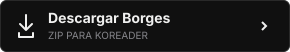
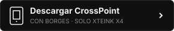
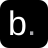

<p align="center"></p>

<p align="center"><strong>Tu lector. Tus subrayados. Una misma biblioteca.</strong><br>Conectá tu lector con Borges y llevá con vos lo que leés.</p>

<p align="center">
  <a href="https://github.com/totokatz/borges.koplugin/releases/latest/download/borges.koplugin.zip"></a>
  <a href="https://github.com/runadev-arg/borges-firmware/releases/latest/download/borges-x4.bin"></a>
</p>

<p align="center">
  <a href="https://github.com/totokatz/borges.koplugin/releases/latest"></a>
  
  
</p>

<p align="center"><a href="#instalar">Instalación</a> · <a href="https://borges.runadev.com/guia/">Guía visual</a> · <a href="https://borges.runadev.com">Abrir Borges</a> · <a href="../README.md">English</a></p>

---

## Elegí tu lector

| Usás… | Descargá | Cómo se instala |
| :--- | :--- | :--- |
| **KOReader** en Kobo, Kindle u otro equipo compatible | **[Plugin · ZIP](https://github.com/totokatz/borges.koplugin/releases/latest/download/borges.koplugin.zip)** | Descomprimí y copiá la carpeta. [Paso a paso ↓](#instalar) |
| **Borges en Xteink X4** | **[Firmware · BIN](https://github.com/runadev-arg/borges-firmware/releases/latest/download/borges-x4.bin)** | Instalá el firmware con la integración incluida. [Guía para X4 →](FIRMWARE.md) |

## Lo que leés, conectado

| En tu lector | En tu biblioteca |
| :--- | :--- |
| **Seguí donde dejaste** | Compartí el progreso entre dispositivos y elegí cuándo retomar la otra posición. |
| **Guardá lo que te importa** | Sincronizá subrayados, notas y marcadores de la misma edición del libro. |
| **Conocé tu ritmo** | Reuní sesiones y estadísticas de lectura en Borges. |
| **Llevate otro libro** | Descargá los EPUB de tu biblioteca desde KOReader. |
| **Leé sin conexión** | Los cambios quedan pendientes y se envían cuando vuelve la red. |

Las funciones de esta sección corresponden al plugin de KOReader. Necesitás **KOReader instalado**, una **cuenta de [Borges](https://borges.runadev.com)** y conexión a internet para vincular y sincronizar. El plugin funciona dentro de KOReader, no en el lector de fábrica de Kobo o Kindle. La ubicación de KOReader depende del dispositivo y de cómo lo instalaste.

## Instalar

### 1. Descargá

Bajá **[borges.koplugin.zip](https://github.com/totokatz/borges.koplugin/releases/latest/download/borges.koplugin.zip)** y descomprimilo en tu computadora.

> Usá ese enlace directo. **Code → Download ZIP** y los archivos **Source code** de GitHub descargan el repositorio, no el paquete listo para instalar.

### 2. Copiá

Adentro del ZIP vas a encontrar **`borges.koplugin`**. Copiá esa carpeta completa dentro de **`koreader/plugins/`** de tu lector. En Kobo, normalmente está en **`.adds/koreader/plugins/`**; activá «mostrar archivos ocultos» si no ves `.adds`.

Así tiene que quedar:

```text
koreader/
└── plugins/
    └── borges.koplugin/
        ├── _meta.lua
        ├── main.lua
        ├── plugin_version.lua
        └── …
```

No copies el ZIP cerrado ni crees una carpeta extra alrededor. **Conservá el nombre de la carpeta:** permite actualizar instalaciones anteriores de Borges. En el menú siempre aparece como **Borges**.

### 3. Conectá

Expulsá el lector de forma segura, reiniciá KOReader y abrí **Herramientas → Borges → Cuenta**. Vinculá el lector siguiendo las indicaciones de pantalla o entrá con tu usuario y contraseña de Borges. Después elegí **Sincronizar ahora**.

Tu biblioteca está en [borges.runadev.com](https://borges.runadev.com). También podés seguir la **[guía de instalación con imágenes](https://borges.runadev.com/guia/)**.

## Un menú, lo necesario

```text
Borges
├── Cuenta              Vincular el lector o entrar a tu cuenta
├── Sincronizar ahora   Enviar y recibir los cambios pendientes
├── Biblioteca          Descargar libros y retomar la lectura
├── Estado y ayuda      Ver el estado y reportar un problema
└── Avanzado            Ajustes y búsqueda de actualizaciones
```

El idioma acompaña a KOReader: castellano si su interfaz está en castellano e inglés en los demás casos.

## Actualizar

Desde el lector: **Borges → Avanzado → Buscar actualizaciones ahora**. Cuando hay una versión disponible aparece **Instalar la versión…** en el menú de Borges. El actualizador verifica los archivos y conserva una copia para volver atrás.

Para actualizar a mano, cerrá KOReader y copiá el contenido del nuevo paquete sobre la carpeta existente, reemplazando los archivos del plugin. **Conservá tus archivos locales de configuración**; el ZIP no los incluye. Reiniciá KOReader al terminar.

<details>
<summary><strong>¿Borges no aparece después de instalar?</strong></summary>

- Comprobá que `main.lua` esté directamente en `koreader/plugins/borges.koplugin/`.
- Si ves `borges.koplugin-main`, descargaste el código fuente. Volvé al botón de descarga.
- Revisá que no haya una segunda carpeta `borges.koplugin` dentro de la primera.
- Reiniciá KOReader por completo; suspender y despertar el lector no alcanza.
- Revisá el administrador de plugins de KOReader y habilitá Borges si está desactivado.

</details>

<details>
<summary><strong>Verificar la descarga con SHA-256</strong></summary>

El [archivo de verificación](https://github.com/totokatz/borges.koplugin/releases/latest/download/borges.koplugin.zip.sha256) permite comprobar que el ZIP se descargó completo. Compará su valor con:

```powershell
# Windows / PowerShell
Get-FileHash .\borges.koplugin.zip -Algorithm SHA256
```

```sh
# macOS
shasum -a 256 borges.koplugin.zip
# Linux
sha256sum -c borges.koplugin.zip.sha256
```

</details>

## Ayuda y código

Para problemas de sincronización: **Borges → Estado y ayuda → Reportar un problema**. Para errores del plugin o compatibilidad, [abrí un issue](https://github.com/totokatz/borges.koplugin/issues/new/choose) con tu dispositivo, versión de KOReader y versión de Borges. No publiques contraseñas, credenciales ni archivos de configuración.

Este repositorio contiene el plugin. La aplicación web y el servidor se mantienen por separado. Consultá las [notas de versión](../borges.koplugin/RELEASE_NOTES.md) y la [guía de publicación](RELEASING.md).

---

<p align="center"><br><sub>Una biblioteca que sigue con vos.</sub></p>
